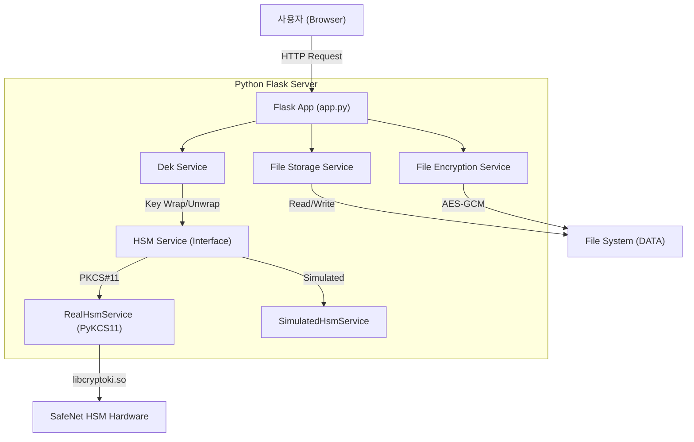
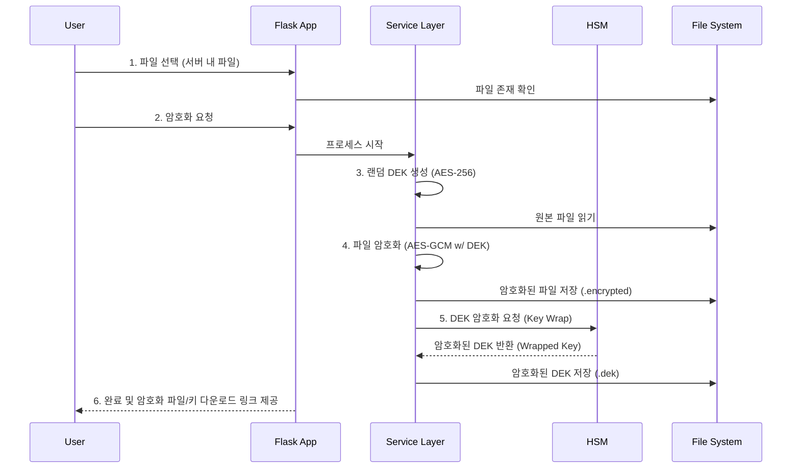
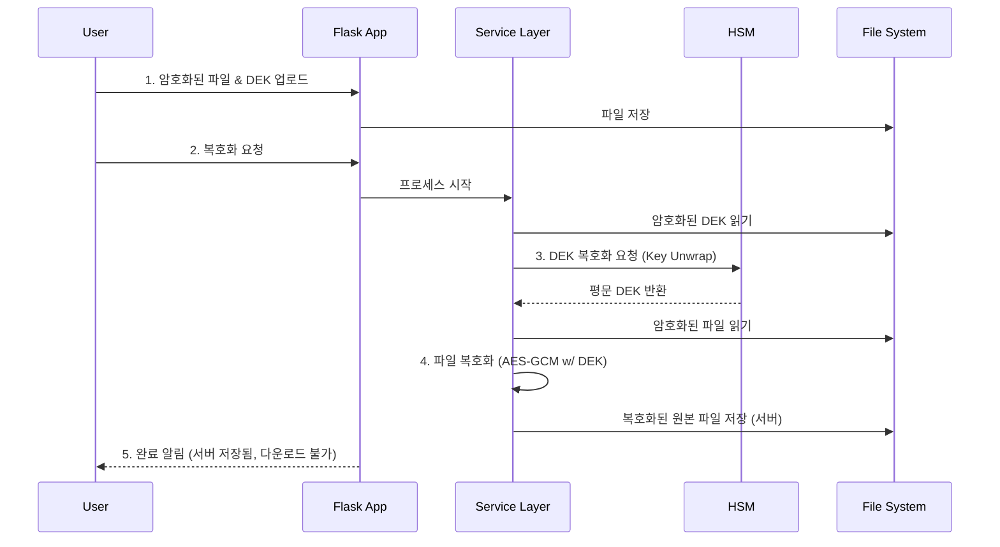

# 파일 암호화 시스템 (File Encryption System) - Python Version

이 프로젝트는 HSM(Hardware Security Module)과 연동하여 파일을 안전하게 암호화하고 복호화하는 Python Flask 기반의 웹 애플리케이션입니다.
암호화 키(DEK)는 HSM의 KEK(Key Encryption Key)로 이중 보호됩니다.

## 주요 기능 (Features)

### 1. 파일 암호화 (Encryption)
- **랜덤 DEK 생성**: 파일마다 고유한 256비트 AES DEK(Data Encryption Key)를 생성합니다.
- **파일 암호화**: 서버의 `DATA` 디렉토리에 있는 파일을 AES-256-GCM 알고리즘으로 암호화합니다.
- **DEK 암호화 (Key Wrapping)**: 생성된 DEK는 HSM의 KEK를 사용하여 안전하게 암호화됩니다.
- **결과물**: `DATA` 디렉토리에 암호화된 파일(`.encrypted`)과 암호화된 DEK 파일(`.dek`)이 생성됩니다.

### 2. 파일 복호화 (Decryption)
- **파일 복원**: 암호화된 파일과 대응하는 DEK 파일을 사용하여 원본 파일을 복원합니다.
- **Key Unwrapping**: HSM을 통해 암호화된 DEK를 복호화하여 사용 가능한 DEK를 추출합니다.
- **검증**: 복호화된 DEK로 파일의 암호화를 해제하고 원본 데이터를 검증합니다.

### 3. 서버 기반 파일 처리 (Server-Side File Processing)
- **DATA 디렉토리**: 모든 파일 작업은 서버의 `DATA` 디렉토리 내에서 이루어집니다.
- **단일 폴더 워크플로우**: 원본 파일, 암호화된 결과물, 복호화된 결과물이 모두 한 곳에서 관리됩니다.

### 4. 유연한 HSM 구성 (Flexible HSM Configuration)
- **모의 HSM (Simulated HSM)**: 실제 장비가 없는 경우 로컬 파일 기반의 시뮬레이션을 제공합니다.
- **실제 HSM (Real HSM)**: SafeNet PKCS#11 라이브러리(`libcryptoki.so`)를 통해 실제 HSM과 연동됩니다.
- **설정 가능 항목**:
    - **Slot ID**: HSM 슬롯 번호를 지정할 수 있습니다. (기본값: `1`)
    - **HSM PIN**: HSM 접근을 위한 PIN을 설정할 수 있습니다. (기본값: `1111`)
    - **KEK Label**: 사용할 키의 라벨을 지정할 수 있습니다. (기본값: `master_key`)

## 시스템 구조 (System Architecture)

### 기술 스택 (Tech Stack)
- **Language**: Python 3.11+
- **Framework**: Flask 3.0
- **Cryptography**: `cryptography` library (Standard AES-GCM), `PyKCS11` (HSM Interface)
- **Frontend**: HTML5, CSS3, JavaScript (Vanilla)

### 시스템 아키텍처 다이어그램


### 2. 데이터 흐름: 암호화 (Data Flow: Encryption)


### 3. 데이터 흐름: 복호화 (Data Flow: Decryption)


## 설치 및 실행 방법 (How to Run)

### 1. 필수 요구사항 (Prerequisites)
- Python 3.x
- SafeNet ProtectToolkit (PTK) Client (실제 HSM 사용 시)
    - `/opt/safenet/protecttoolkit7/cpsdk/setvars.sh` 스크립트가 필요합니다.

### 2. 가상환경 설정 및 의존성 설치
프로젝트 루트에서 `start.sh`를 실행하면 자동으로 `venv`를 생성하고 의존성을 설치합니다.
수동으로 설치하려면:
```bash
python3 -m venv venv
source venv/bin/activate
pip install -r requirements.txt
```

### 3. 시작 (Start)
애플리케이션을 시작합니다.
```bash
./start.sh
```
- 접속 주소: `http://localhost:5000`
- **주의**: 5000번 포트를 사용합니다.

### 4. 종료 (Stop)
```bash
./stop.sh
```

### 5. 재시작 (Restart)
```bash
./restart.sh
```

## 설정 (Configuration)
웹 인터페이스의 우측 상단 **설정(Settings)** 아이콘을 클릭하여 HSM 모드를 변경할 수 있습니다.
- **Use Real HSM**: 체크 시 실제 HSM 라이브러리(`libcryptoki.so`)를 로드합니다.
- **HSM Slot ID**: 사용할 슬롯 번호 입력.
- **HSM PIN**: 파티션/슬롯 비밀번호 입력.
- **KEK Label**: 래핑에 사용할 키 객체의 라벨 입력.

### 6. 환경 변수 설정 (.env)
프로젝트 루트에 `.env` 파일을 생성하여 설정을 관리할 수 있습니다.
```ini
# LUNA Config
LUNA_LIB_PATH=/opt/safenet/lunaclient/lib/libCryptoki2_64.so
LUNA_HSM_PIN=12341234
LUNA_HSM_SLOT=1
LUNA_HSM_LABEL=master_key

# PSE Config
PSE_LIB_PATH=/opt/safenet/protecttoolkit7/ptk/lib/libcryptoki.so
PSE_HSM_PIN=1111
PSE_HSM_SLOT=1
PSE_HSM_LABEL=master_key

# AWS KMS Config
AWS_ACCESS_KEY_ID=
AWS_SECRET_ACCESS_KEY=
AWS_REGION=ap-northeast-2
AWS_KMS_KEY_ID=alias/example-key
```

## 암호화 오버헤드 (Encryption Overhead)
AES-GCM 알고리즘 특성상 암호화된 파일은 원본보다 정확히 **28바이트** 커집니다.
- **IV**: 12 bytes
- **Tag**: 16 bytes
```
